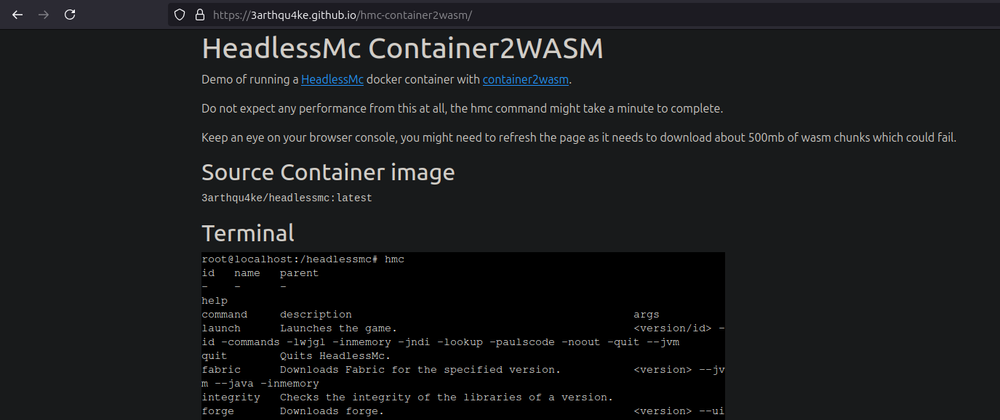

> [!WARNING]
> Had to take down the page. It downloaded ~500mb of wasm files everytime, so this organizations data limits were quickly exceeded.  
> The performance was questionable to say the least.

# HeadlessMc-Container2WASM

This page takes the [container2wasm](https://github.com/ktock/container2wasm) demo
from [here](https://github.com/ktock/container2wasm-demo) and uses it to run a
[HeadlessMc](https://github.com/3arthqu4ke/headlessmc) Docker image inside the browser.
This is just for fun and runs about as well as you would
expect from three VMs stacked on top of each other.

**This page downloads about ~500mb of wasm file**s!

Page: https://3arthqu4ke.github.io/hmc-container2wasm/

## Building images

Run `./create-images.sh`

container2wasm needs to be available on the host.

## License

Apache License Version 2.0.

This repository contains code copied from https://github.com/ktock/container2wasm-demo.
Changes: The debian, python and vim images have been removed for a HeadlessMc image.

Additionally, this repository relies on third-pirty softwares:

- Bootstrap ([MIT License](https://github.com/twbs/bootstrap/blob/main/LICENSE)): https://github.com/twbs/bootstrap
- xterm-pty ([MIT License](https://github.com/mame/xterm-pty/blob/main/LICENSE.txt)): https://github.com/mame/xterm-pty
- xterm.js ([MIT License](https://github.com/xtermjs/xterm.js/blob/master/LICENSE)): https://github.com/xtermjs/xterm.js
- coi-serviceworker.js([MIT License](https://github.com/gzuidhof/coi-serviceworker/blob/master/LICENSE)): https://github.com/gzuidhof/coi-serviceworker
- `browser_wasi_shim` (either of [MIT License](https://github.com/bjorn3/browser_wasi_shim/blob/main/LICENSE-MIT) and [Apache License 2.0](https://github.com/bjorn3/browser_wasi_shim/blob/main/LICENSE-APACHE)): https://github.com/bjorn3/browser_wasi_shim
- container2wasm-genearted images:
  - Containers
    - alpine-based containers: https://pkgs.alpinelinux.org/packages
    - debian-based containers: see `/usr/share/doc/*/copyright`
  - Other dependencies(emulator, etc): https://github.com/ktock/container2wasm#acknowledgement
